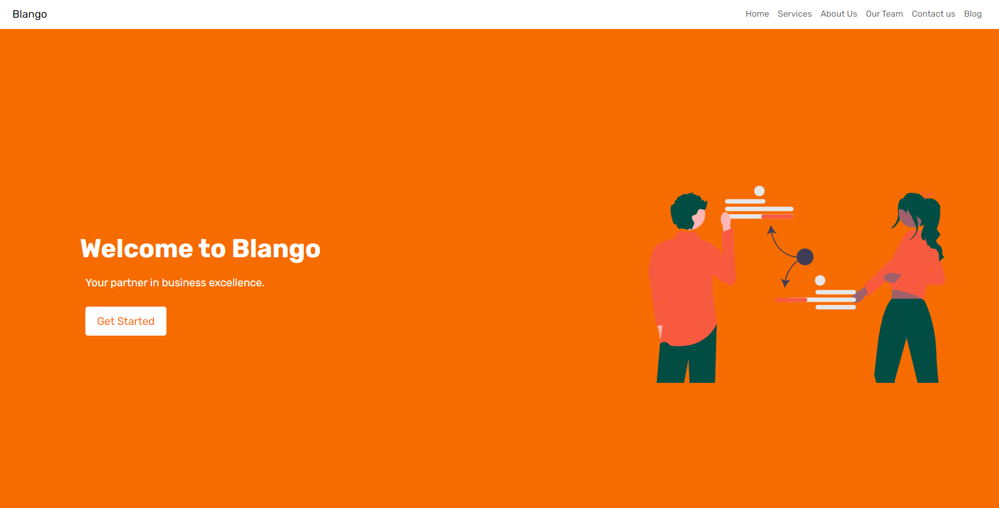

# blango

a simple agency app using django framework

<p align="center">
  <a href="https://github.com/MLankaoui/blango"></a>
</p>

## How to use

- clone the repository

```bash
    git clone https://github.com/MLankaoui/blango.git
    cd blango
```

- activate the virtual environement

windows:

```bash
    .\venv\Script\activate
```

linux:

```bash
    source venv/Script/activate
```

- start the local server
  windows:

```bash
    python manage.py runserver

```

linux:

```bash
    python3 manage.py runserver

```
